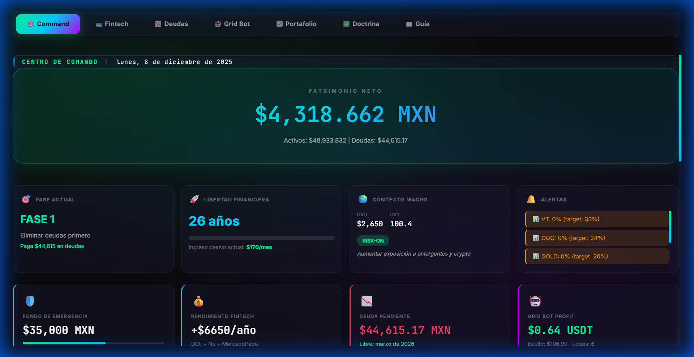

# 🦈 Vantage Quantum Bot: Remora Edition (v2.1.0)

> "The Remora attaches itself to the Shark. Where the Shark goes, the Remora feeds."



## 🚀 Overview
**Vantage Quantum (Remora Edition)** is a high-frequency grid trading bot designed for **BTC/USDT** on Binance. Unlike "dumb" grid bots, it uses **Composite Market Intelligence** to adapt its behavior in real-time. It acts as a "Remora fish," detecting large market movements (Sharks/Whales) via Order Book Pressure and riding their wake.

**Current Version:** `2.1.0`
**License:** Private (Arca Financiera Garossa)

## ✨ Key Features

### 1. 🧠 Shark Mode (Order Book Intelligence)
The bot reads the Order Book depth in real-time to calculate **Order Book Pressure**.
- **Sell Wall Detected (Pressure < 0.3):** The bot *pauses* buy orders to avoid catching a falling knife.
- **Buy Wall Detected (Pressure > 3.0):** The bot *pauses* sell orders to let the price run up.
- **Result:** It avoids trading *against* the Whales.

### 2. 💸 Real Net Profit Calculation
Most bots show "Gross Profit" (Profit before fees). We do it better:
- **Fee Awareness:** Automatically deducts **0.1%** (Maker/Taker) or **0.075%** (BNB Discount) from every trade.
- **Net Pocket:** The "Total Profit" shown in the UI is 100% realized, withdrawable cash.
- **Retroactive Sanitization:** On startup, it re-scans history to ensure no "phantom profit" exists.

### 3. 🛡️ Risk Management (Circuit Breakers)
- **Emergency Stop:** If Equity drops > 10% rapidly, the bot halts.
- **Geopolitical Context:** Widens grid spacing during high-risk global events (Election Cycles, FED meetings).
- **BTC Flight-to-Safety:** Monitors BTC Dominance to adjust aggression.

### 4. ⚡ High-Performance UI
- **Real-Time Websocket:** Sub-second updates.
- **Neon Aesthetic:** Dark mode optimized for night trading.
- **Transaction Log:** Sortable history with "Today" highlighter (Neon Blue Border).
- **Triangle Visualizer:** Real-time canvas rendering of the current trade setup.

## 🛠️ Installation & Setup

### Prerequisites
- Node.js (v18+)
- Binance API Key (Spot Trading Enabled)

### Quick Start
1.  **Clone the Repo:**
    ```bash
    git clone https://github.com/your-repo/vantage-bot.git
    cd vantage-bot
    ```

2.  **Install Dependencies:**
    ```bash
    npm install
    ```

3.  **Configure Creds:**
    Create a `.env` file:
    ```env
    BINANCE_API_KEY=your_key
    BINANCE_SECRET=your_secret
    ```

4.  **Run:**
    ```bash
    # Run with auto-restart (Recommended)
    nodemon grid_bot.js

    # Or standard node
    npm start
    ```

## 📊 Configuration (`grid_bot.js`)

You can tweak the "Remora" behavior in the `CONFIG` object:

```javascript
const CONFIG = {
    pair: 'BTC/USDT',
    tradingFee: 0.001,       // 0.1% (Set to 0.00075 if paying with BNB)
    gridSpacing: 0.003,      // 0.3% base spacing (Adaptive)
    gridCount: 16,           // Max grid lines
    riskLevel: 'AGGRESSIVE'  // AGGRESSIVE | MODERATE | CONSERVATIVE
};
```

## 📜 recent Changelog (v2.1.0)
- **[NEW]** Shark Logic: Order Book Pressure integration.
- **[FIX]** Profit Math: Retroactive fee deduction logic.
- **[UI]** Added "Today" transaction highlighter.
- **[UI]** Fixed "Bouncing Log" issue.

---
*Built with ❤️ by Antigravity for Arca Financiera Garossa.*